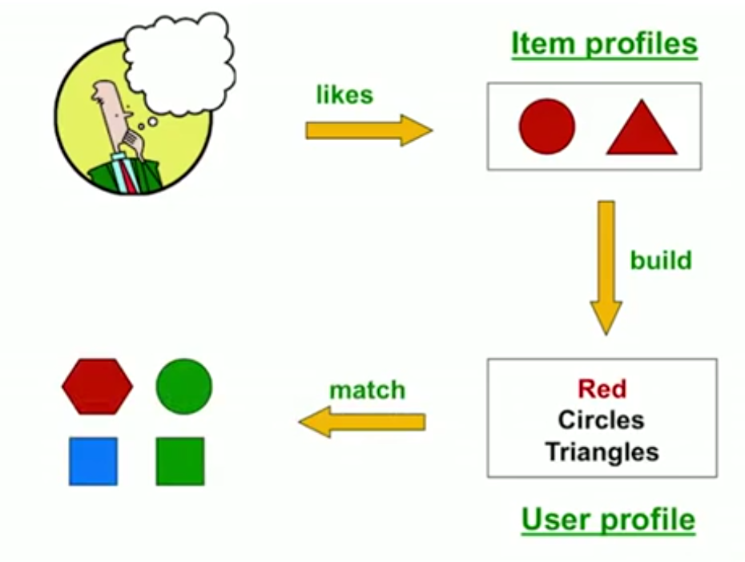
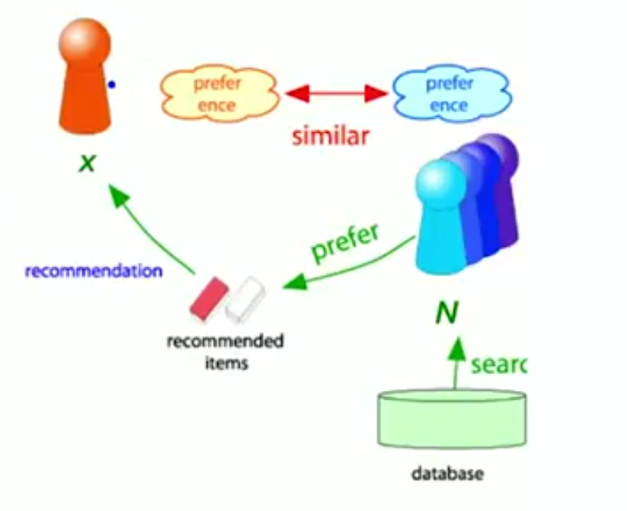

# Informe

## 1. Repositorio

[SRI-hybrid-techniques-in-recommendation-systems](https://github.com/BritoAlv/SRI-hybrid-techniques-in-recommendation-systems)

## 2. Autores

- Álvaro Luis González Brito C-312 [@BritoAlv](https://github.com/BritoAlv)
- David Lezcano Becerra C-312 [@david-dlb](https://github.com/david-dlb)
- Javier Lima García C-312 [@limaJavier](https://github.com/limaJavier)

## 3. Descripción del Tema

Hoy en día son numerosas las aplicaciones en las que confluyen usuarios para consumir, comprar, o vender un conjunto de productos, servicios, artículos o propiedades. Dada la infinidad de opciones que poseen los usuarios, se dificulta no solo la búsqueda de lo deseado, sino que incluso estos desconocen o son incapaces de encontrar aquello que realmente estaban buscando y dejan pasar opciones óptimas ajustadas a sus necesidades, preferencias o recursos.

Este problema, acrecentado por la magnitud de datos de la actualidad, ha sido objetivo de muchas investigaciones y ha dado a luz a los **Sistemas de Recomendaciones**. Estos sistemas son capaces de acercar aquellos productos (recursos, artículos, etc) que satisfacen las preferencias y necesidades particulares de cada usuario; de ahí que plataformas como Netflix, Amazon, YouTube o Spotify los utilicen y hayan contribuido profundamente al desarrollo de estos.

Existen dos tipos fundamentales de Sistemas de Recomendación: el *filtrado por contenido* (content-base filtering) y el *filtrado por colaboración* (collaborative filtering).

**Nota**: Por motivos de simplicidad se decide utilizar `productos` para referirse a todo lo que los Sistemas de Recomendación puedan ofrecer, así como `consumir` para todas las acciones que los usuarios puedan hacer con estos productos.

### 3.1 Filtrado por contenido

La idea fundamental del *filtrado por contenido* radica en: *recomendar a un usuario productos similares a aquellos que el usuario previamente ha consumido*

De esta idea se deriva la siguiente cuestión: `¿cómo encontrar los artículos similares?`

Numerosas estrategias han sido diseñadas para responder a esta pregunta y dentro de estas resalta la *construcción de perfiles*. Esta, se basa en la creación de perfiles para los productos y para los usuarios, fundamentalmente, creando una representación vectorial de estos:

- Los productos son vectorizados teniendo en cuenta el contexto, metadatos y requerimientos (vectores reales o vectores booleanos)
- Los vectores asociados a usuarios pueden obtenerse por numerosas vías, desde un simple promedio de los vectores asociados a productos consumidos, a un promedio ponderado o incluso utilizando técnicas basadas en Machine Learning

Una vez llevada a cabo la vectorización, puede usarse directamente la `similitud del coseno` para encontrar aquellos perfiles de productos más similares al perfil del usuario seleccionado.

### 3.2 Filtrado colaborativo

El *filtrado colaborativo* posee dos vertientes distintas, y teóricamente equivalentes llamadas:

- `Usuario-Usuario (user to user)`: *Recomendar a un usuario aquellos productos que han consumido usuarios similares a él/ella*
- `Producto-Producto (item to item)`: *Recomendar un producto a un usuario si productos similares a este han sido consumidos previamente por dicho usuario*

Como en el método anterior se nos presenta nuevamente el problema de la similaridad, sin embargo, a diferencia de este, en el filtrado colaborativo se cuenta con la *matriz de similaridad*, cuyas coordenadas, por ejemplo, (i, j) contienen cuánto ha estimado (rated en inglés) el usuario i al producto j. 

Con esta matriz y utilizando, generalmente, la similitud `centrada del coseno` (centered cosine similarity) conocida también como `Correlación de Pearson` (Pearson Correlation), podemos predecir cuánto estimará un usuario un determinado producto, de la siguiente manera:

#### Usuario-Usuario

Para un producto i y usuario x, donde N es el conjunto de los k usuarios más similares a x que han consumido el producto i, la predicción es la siguiente:

#### Producto-Producto

Para un producto i y un usuario x, donde N es el conjunto de los k productos más similares a i que han sido consumidos por x, la predicción es la siguiente:

Para ambos casos, s es la similitud (en el primero entre usuarios y en el segundo entre productos) y r cuánto ha estimado al producto.

Como se mencionó previamente, ambas estrategias del filtrado colaborativo son teóricamente equivalentes (incluso podrían considerarse duales), sin embargo, en la práctica *Producto-Producto* vence a *Usuario-Usuario*, y esto, debido, a que los productos son más "sencillos" que los usuarios en el sentido de que es más fácil clasificarlos (géneros en la música, estilos en pintura, etc.), mientras que los usuarios son más impredecibles, lo que lleva a que el criterio de similitud entre productos aporte una mayor relevancia que entre usuarios.

### 3.3 Recomendación híbrida

Como su nombre indica, la recomendación híbrida pretende tomar lo mejor de ambos mundos (basado en contenido y colaborativo) para amplificar el poder de los sistemas de recomendación. Pueden utilizarlos de manera separada para después combinar los resultados ponderadamente o bajo selección, o integrarlos directamente en un solo modelo.

Netflix es un buen ejemplo de esto, esta plataforma ofrece recomendaciones comparando los hábitos de búsqueda y visualizaciones de usuarios similares, así como, ofreciendo películas que comparten características similares con aquellas que el usuario ha tenido en alta estima.

## 4. Antecedentes

Elaine Rich creó el primer Sistema de Recomendación en 1979, llamado *Grundy*. Buscaba una forma de recomendar a usuarios libros que les pudieran gustar. Su idea fue crear un sistema que realizara preguntas específicas y las clasificara en clases de preferencias o "estereotipos", en dependencia de sus respuestas. Basado en esta pertenencia a un cierto estereotipo, los usuarios recibirían recomendaciones de libros.

Otro de los primeros Sistemas de Recomendación, es el llamado *"librero digital"* (digital bookshelf), el cual fue descrito en un reporte técnico en 1990 por Jussi Karlgren en la Universidad de Columbia, e implementado a escala y continuado mediante reportes técnicos y publicaciones desde 1994 en adelante por Jussi Karlgren, en ese entonces en el SICS, en conjunto con el grupo investigativo dirigido por Pattie Maes del MIT, Will Hill de Bellcore y Paul Resnick, también del MIT. Este trabajo, junto con GroupLens, fue premiado en 2010 por la ACM Software Systems Award.