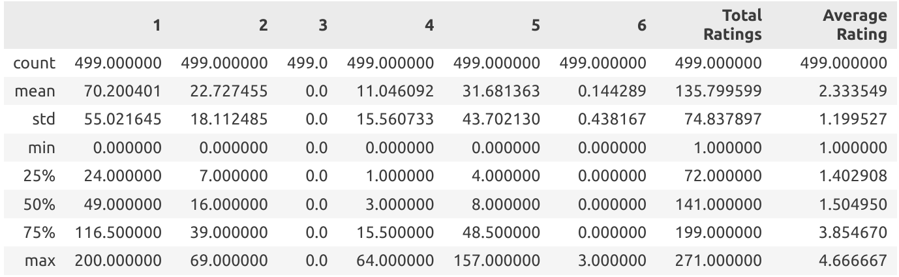

# Informe

## 1. Repositorio

[SRI-hybrid-techniques-in-recommendation-systems](https://github.com/BritoAlv/SRI-hybrid-techniques-in-recommendation-systems)

## 2. Autores

- Álvaro Luis González Brito C-312 [@BritoAlv](https://github.com/BritoAlv)
- David Lezcano Becerra C-312 [@david-dlb](https://github.com/david-dlb)
- Javier Lima García C-312 [@limaJavier](https://github.com/limaJavier)

## 3. Descripción del Tema

Hoy en día son numerosas las aplicaciones en las que confluyen usuarios para consumir, comprar, o vender un conjunto de productos, servicios, artículos o propiedades. Dada la infinidad de opciones que poseen los usuarios, se dificulta no solo la búsqueda de lo deseado, sino que incluso estos desconocen o son incapaces de encontrar aquello que realmente estaban buscando y dejan pasar opciones óptimas ajustadas a sus necesidades, preferencias o recursos.

Este problema, acrecentado por la magnitud de datos de la actualidad, ha sido objetivo de muchas investigaciones y ha dado a luz a los **Sistemas de Recomendaciones**. Estos sistemas son capaces de acercar aquellos productos (recursos, artículos, etc) que satisfacen las preferencias y necesidades particulares de cada usuario; de ahí que plataformas como Netflix, Amazon, YouTube o Spotify los utilicen y hayan contribuido profundamente al desarrollo de estos.

Existen dos tipos fundamentales de Sistemas de Recomendación: el *filtrado por contenido* (content-base filtering) y el *filtrado por colaboración* (collaborative filtering).

**Nota**: Por motivos de simplicidad se decide utilizar `productos` para referirse a todo lo que los Sistemas de Recomendación puedan ofrecer, así como `consumir` para todas las acciones que los usuarios puedan hacer con estos productos.

### 3.1 Filtrado por contenido


La idea fundamental del *filtrado por contenido* radica en: *recomendar a un usuario productos similares a aquellos que el usuario previamente ha consumido*

De esta idea se deriva la siguiente cuestión: `¿cómo encontrar los artículos similares?`

Numerosas estrategias han sido diseñadas para responder a esta pregunta y dentro de estas resalta la *construcción de perfiles*. Esta, se basa en la creación de perfiles para los productos y para los usuarios, fundamentalmente, creando una representación vectorial de estos:

- Los productos son vectorizados teniendo en cuenta el contexto, metadatos y requerimientos (vectores reales o vectores booleanos)
- Los vectores asociados a usuarios pueden obtenerse por numerosas vías, desde un simple promedio de los vectores asociados a productos consumidos, a un promedio ponderado o incluso utilizando técnicas basadas en Machine Learning

Una vez llevada a cabo la vectorización, puede usarse directamente la `similitud del coseno` para encontrar aquellos perfiles de productos más similares al perfil del usuario seleccionado.

### 3.2 Filtrado colaborativo


El *filtrado colaborativo* posee dos vertientes distintas, y teóricamente equivalentes llamadas:

- `Usuario-Usuario (user to user)`: *Recomendar a un usuario aquellos productos que han consumido usuarios similares a él/ella*
- `Producto-Producto (item to item)`: *Recomendar un producto a un usuario si productos similares a este han sido consumidos previamente por dicho usuario*

Como en el método anterior se nos presenta nuevamente el problema de la similaridad, sin embargo, a diferencia de este, en el filtrado colaborativo se cuenta con la *matriz de similaridad*, cuyas coordenadas, por ejemplo, (i, j) contienen cuánto ha estimado (rated en inglés) el usuario i al producto j. 

Con esta matriz y utilizando, generalmente, la similitud `centrada del coseno` (centered cosine similarity) conocida también como `Correlación de Pearson` (Pearson Correlation), podemos predecir cuánto estimará un usuario un determinado producto, de la siguiente manera:

#### Usuario-Usuario

Para un producto i y usuario x, donde N es el conjunto de los k usuarios más similares a x que han consumido el producto i, la predicción es la siguiente:


#### Producto-Producto

Para un producto i y un usuario x, donde N es el conjunto de los k productos más similares a i que han sido consumidos por x, la predicción es la siguiente:


Para ambos casos, s es la similitud (en el primero entre usuarios y en el segundo entre productos) y r cuánto ha estimado al producto.

Como se mencionó previamente, ambas estrategias del filtrado colaborativo son teóricamente equivalentes (incluso podrían considerarse duales), sin embargo, en la práctica *Producto-Producto* vence a *Usuario-Usuario*, y esto, debido, a que los productos son más "sencillos" que los usuarios en el sentido de que es más fácil clasificarlos (géneros en la música, estilos en pintura, etc.), mientras que los usuarios son más impredecibles, lo que lleva a que el criterio de similitud entre productos aporte una mayor relevancia que entre usuarios.

### 3.3 Recomendación híbrida

Como su nombre indica, la recomendación híbrida pretende tomar lo mejor de ambos mundos (basado en contenido y colaborativo) para amplificar el poder de los sistemas de recomendación. Pueden utilizarlos de manera separada para después combinar los resultados ponderadamente o bajo selección, o integrarlos directamente en un solo modelo.

Netflix es un buen ejemplo de esto, esta plataforma ofrece recomendaciones comparando los hábitos de búsqueda y visualizaciones de usuarios similares, así como, ofreciendo películas que comparten características similares con aquellas que el usuario ha tenido en alta estima.

## 4. Antecedentes

Elaine Rich creó el primer Sistema de Recomendación en 1979, llamado *Grundy*. Buscaba una forma de recomendar a usuarios libros que les pudieran gustar. Su idea fue crear un sistema que realizara preguntas específicas y las clasificara en clases de preferencias o "estereotipos", en dependencia de sus respuestas. Basado en esta pertenencia a un cierto estereotipo, los usuarios recibirían recomendaciones de libros.

Otro de los primeros Sistemas de Recomendación, es el llamado *"librero digital"* (digital bookshelf), el cual fue descrito en un reporte técnico en 1990 por Jussi Karlgren en la Universidad de Columbia, e implementado a escala y continuado mediante reportes técnicos y publicaciones desde 1994 en adelante por Jussi Karlgren, en ese entonces en el SICS, en conjunto con el grupo investigativo dirigido por Pattie Maes del MIT, Will Hill de Bellcore y Paul Resnick, también del MIT. Este trabajo, junto con GroupLens, fue premiado en 2010 por la ACM Software Systems Award.

## 5. Solución

En este proyecto decidimos construir un Sistema de Recomendación Híbrido, capaz de recomendar libros a usuarios (haciendo honor a *Grundy* el primer Sistema de Recomendación) utilizando ambos métodos: *filtrado por contenido* y *filtrado colaborativo*

## 6. Implementación

## 7. Evaluación

## 8. Puntos a mejorar

## 9. Datos utilizados

La información utilizada para el proyecto se encuentra almacenada en una base de datos (específicamente utilizamos SQLite como SGBD), que contiene como tablas principales: *Books*, *Users* y *UserBooks* (presenta los datos obtenidos de una interacción usuario-libro, como: rating, comentarios, cantidad de shares y ratio de lectura)

La información presente en esta base de datos fue obtenida de dos formas (utilizando el script `data_collector.py`):

- Para los metadatos sobre los libros (tabla *Books*) fue utilizada la API [**Gutendex**](https://gutendex.com/), que provee los metadatos de los libros almacenados por el [**Proyecto Gutenberg**](https://www.gutenberg.org/)
- Para los usuarios (tabla *Users*) y las interacciones usuario-libro (tabla *UserBooks*), se simuló el comportamiento de estos con respecto a un conjunto de libros.

### 9.1 Extracción de los libros

La extracción de los metadatos asociados a libros fue bastante directa a través de [**Gutendex**](https://gutendex.com/). La única transformación realizada se produjo durante la extracción de los géneros; y es que, dada la multitud de géneros existentes, se predefinió un conjunto de estos (tabla *Genres*), y según la similitud de estos con la sección `subject` de los datos de la API, fueron añadidos los géneros a cada libro.

### 9.2 Generación de usuarios e interacciones

Para generar usuarios e interacciones con libros lo más cercano a la realidad, se decidió utilizar la siguiente estrategia:

Dado los *k* libros más populares y los *p* autores más populares (la API brinda la información de cuántas veces un libro ha sido descargado), se generó un usuario que va a presentar tres características distintas, generadas aleatoriamente:

- Época preferida (antigua, moderna o contemporánea)
- Autores preferidos (de los autores más populares)
- Géneros preferidos

Con este perfil de usuario se procedió a escoger de 1 a 300 libros (de los más populares) con los que el usuario potencialmente interactuará. Por cada libro validamos lo siguiente:

- Si el libro pertenece a un género que le gusta al usuario, o su autor es uno de los preferidos del usuario, o pertenece a la época favorita del usuario, entonces tendrá una interacción "positiva" (más adelante se explicará en qué consiste)
- Si no se cumple ninguna condición anterior entonces tendrá una interacción "negativa"

**Interacciones**:

Una *interacción positiva* colocará de manera aleatoria valores considerados positivos para la interacción, de manera *análoga* se produce para una *interacción negativa*. A forma de ejemplo, mostramos nuestra implementación:

```py
def _positive_user_book(self, user_id : int, book_id : int):
        shared = random.randint(3, 20)
        read_ratio = random.randint(50, 100) / 100
        rating = random.randint(3, 5)
        comment = random.choice([
            'It is a really good book. I would read it again',
            'Just love it',
            'I would recommend this book to anyone. It is a hidden diamond'
        ])

        user_book = UserBook(user_id, book_id)
        user_book.shared = shared
        user_book.readRatio = read_ratio
        user_book.rating = rating
        user_book.comment = comment
        return user_book

def _negative_user_book(self, user_id : int, book_id : int):
        shared = random.randint(0, 2)
        read_ratio = random.randint(0, 50) / 100
        rating = random.randint(0, 2)
        comment = random.choice([
            "Simply don't like the book",
            "It's awful",
            "Terrible book! (in the bad sense)"
        ])

        user_book = UserBook(user_id, book_id)
        user_book.shared = shared
        user_book.readRatio = read_ratio
        user_book.rating = rating
        user_book.comment = comment
        return user_book
```

### 9.3 Análisis estadístico

Fue realizado un análisis estadístico sobre los datos generados para comprobar el comportamiento de anomalías que pudieran afectar la validez de nuestro sistema de recomendación. Para esto se tomó como referencia la cantidad de cada uno de los ratings (overall en este caso) por usuario y por libros.



Como podemos apreciar por una descripción global de los datos seleccionados, existe una tendencia hacia los ratings negativos, así como una nula y casi nula existencia de ratings de 3 y 6, respectivamente. Dado que es poco común que esto se produzca con datos reales, fue realizado un análisis más profundo utilizando el **z-score**. Los resultados obtenidos fueron los siguientes:

- *3%* de los datos asociados a usuarios presentan anomalías
- *0.03%* de los datos asociados a libros presentan anomalías

Dada el bajo porcentaje de anomalías encontradas y el contexto del proyecto (no se trabaja con información financiera o médica de alto riesgo, por ejemplo), se decidió que los datos son viables para la prueba del sistema.

## 10. Bibliografías

- Li, Qing & Kim, Byeong. (2003). An approach for combining content-based and collaborative filters. 17-24. 10.3115/1118935.1118938. 
- P. Resnick, N. Iacovou, M. Suchak, P. Bergstrom, and J. Riedl, "GroupLens: an open architecture for collaborative filtering of netnews," presented at the Proceedings of the 1994 ACM conference on Computer supported cooperative work - CSCW '94, Chapel Hill, North Carolina, USA, 1994.
-J. Leskovec, A. Rajaraman, and J. Ullman, Mining of Massive Datasets, 2nd ed. Cambridge, U.K.: Cambridge University Press, 2014.
- Artificial Intelligence - All in One, "Mining Massive Datasets - Stanford University", YouTube, [Playlist], Accessed: Aug. 31, 2024. [Online]. Available: https://youtube.com/playlist?list=PLLssT5z_DsK9JDLcT8T62VtzwyW9LNepV&feature=shared.
- Karlgren, Jussi (October 2017). "A digital bookshelf: original work on recommender systems". Retrieved October 27, 2017.